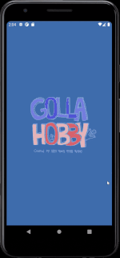

# GollaHobby

> 2020년 01월 27일 ~ 2020년 02월 27일  
> 이니로 동계 안드로이드(java) 멘토링 팀 프로젝트

## 🖇️ Contents
- [GollaHobby](#gollahobby)
  - [🖇️ Contents](#️-contents)
  - [💻 Stack](#-stack)
  - [💡 Features](#-features)
    - [1. Video tutorial](#1-video-tutorial)
    - [2. ViewPager](#2-viewpager)
    - [3. SeekBar](#3-seekbar)
    - [4. RadarChart](#4-radarchart)
  - [Authors](#authors)

<h3 align='center'>Preview</h3>

  

## 💻 Stack

  
  
  

## 💡 Features

### 1. Video tutorial
  * `VideoView`를 활용한 동영상 튜토리얼 제공

### 2. ViewPager
  * `ViewPager`를 활용한 탭 레이아웃(`tab layout`) 구성

### 3. SeekBar
  * `SeekBar`를 정도 측정 및 진행 현황 표시

### 4. RadarChart
  * `RadarChart`를 이용하여 수행 결과를 그래프 형태로 표시

## Authors

* [auddus16](https://github.com/auddus16)
* [sally5131](https://github.com/sally5131)
* [yunjin99](https://github.com/yunjin99)
* [Byun-Sung-Ho](https://github.com/Byun-Sung-Ho)
* [201411108](https://github.com/201411108)

See also the list of [contributors](https://github.com/sally5131/GollaHobby/graphs/contributors) who participated in this project.